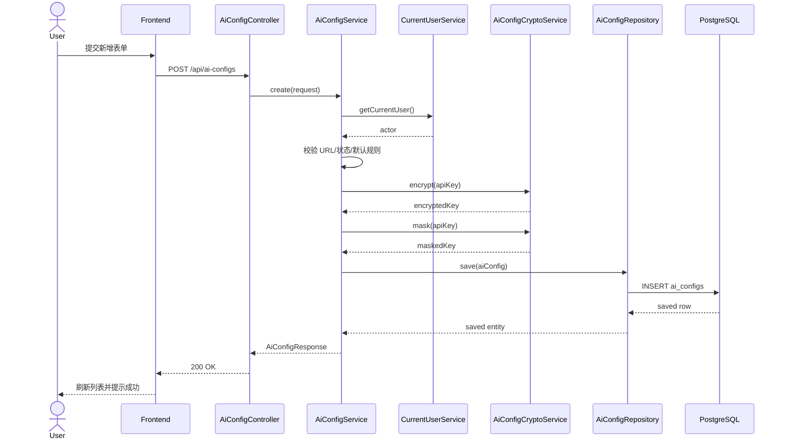
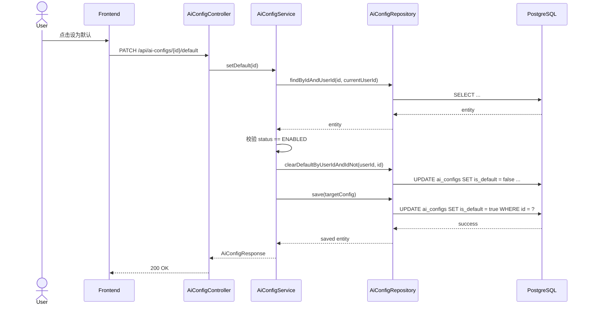
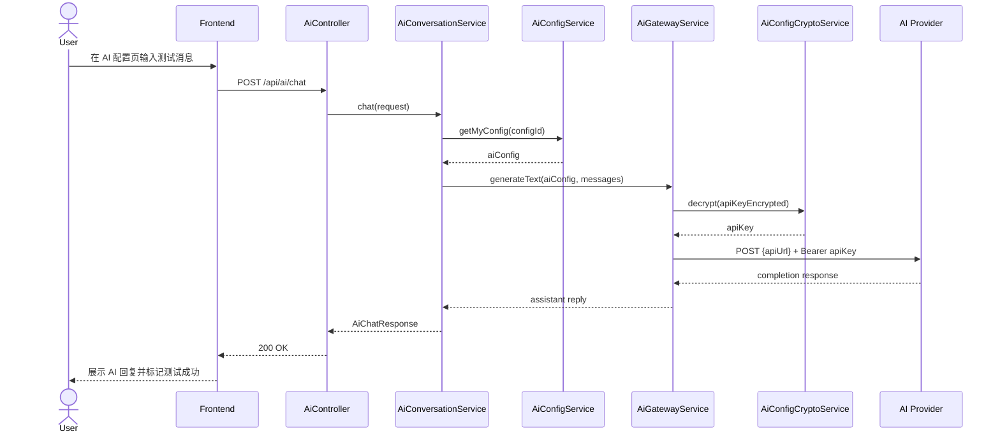
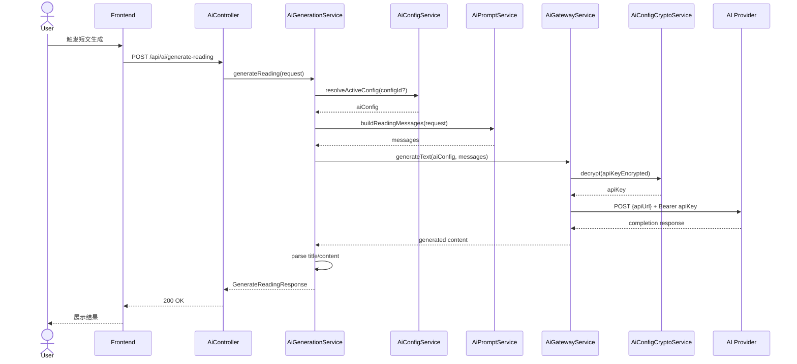

# AI 配置管理设计文档

## 1. 文档目标

本文档用于将 [AI 配置管理功能需求文档](./ai-config-management-requirements.zh-CN.md) 落实为当前 `word-backend` 项目可执行的设计方案，覆盖：

1. 数据库表结构与 Flyway 脚本设计
2. 后端实体、DTO、服务、权限与加密方案
3. AI 示例调用链路与第三方网关封装
4. 前端页面落点、交互与接口适配方案
5. 关键时序图、异常流与测试策略

本文档只做设计，不直接修改业务代码。

## 2. 当前代码约束

结合当前主干代码，AI 配置管理的设计必须遵守以下现状约束：

### 2.1 后端技术栈

- Spring Boot `3.1.8`
- Spring MVC + Spring Security + Spring Data JPA
- PostgreSQL + Flyway
- Java `17`
- Lombok 已在实体与 DTO 中广泛使用

### 2.2 安全与认证

- `SecurityConfig` 已配置 `/api/auth/login`、`/api/auth/logout`、`/api/auth/quote` 免登录
- 其他 `/api/**` 默认要求认证
- 当前通过 `CurrentUserService` 获取当前登录用户
- 当前通过 `AccessControlService` 封装资源访问控制

### 2.3 数据访问与实体风格

- 实体普遍使用 `@Entity + @Data + @NoArgsConstructor + @AllArgsConstructor`
- 审计字段通过 `@CreatedDate`、`@LastModifiedDate` 自动维护
- Repository 以 `JpaRepository` 为主
- DTO 以 `jakarta.validation` 注解做参数校验

### 2.4 前端形态

- `frontend`：教师 / 学生主端，单页应用，以 modal 形式承载复杂管理功能
- `admin-frontend`：后台工作台，基于路由页面组织

### 2.5 外部 HTTP 调用约束

当前项目未引入 `spring-boot-starter-webflux`，也没有现成的第三方 AI SDK。

因此本设计选择：

- 后端 AI 请求使用 `RestTemplate`
- 不新增 WebFlux 依赖
- 首期对接协议采用“OpenAI-compatible Chat Completions”风格

## 3. 设计结论

本次设计采用以下主方案：

1. 新增独立表 `ai_configs` 保存每个用户的私有 AI 配置
2. 每条配置强绑定 `user_id`，所有查询默认按当前登录用户过滤
3. `api_key` 采用应用层 `AES/GCM` 加密后落库
4. 数据库用“部分唯一索引”保证单用户最多一个默认配置
5. 后端新增两类服务：
   - `AiConfigService`：配置 CRUD、默认切换、权限校验
   - `AiGatewayService`：解密密钥并发起第三方 AI 请求
6. AI 示例接口首期包含“配置页对话测试”和“生成阅读短文”
7. 用户端 `frontend` 以 modal 形式提供老师 / 学生配置管理
8. 管理端 `admin-frontend` 以独立 page 形式提供管理员配置管理

## 4. 非目标

本期不做以下内容：

1. 平台级共享 AI 配置
2. 多租户组织级 AI 凭证池
3. 调用账单、额度和限流统计
4. 厂商私有协议深度适配
5. 提示词模板中心
6. AI 调用历史审计表

## 5. 总体架构

### 5.1 后端分层

```text
Controller
  -> AiConfigService
     -> AiConfigRepository
     -> AiConfigCryptoService
     -> CurrentUserService / AccessControlService

Controller
  -> AiConversationService
     -> AiConfigService
     -> AiGatewayService
        -> RestTemplate

Controller
  -> AiGenerationService
     -> AiConfigService
     -> AiGatewayService
        -> RestTemplate
```

### 5.2 模块职责

- `AiConfigController`
  - 配置 CRUD、状态切换、默认配置切换、连通性测试
- `AiController`
  - 示例 AI 业务接口，例如配置页对话测试、阅读短文生成
- `AiConfigService`
  - 配置管理主服务，包含归属校验和默认规则
- `AiConfigCryptoService`
  - API Key 加解密与掩码生成
- `AiGatewayService`
  - 统一封装外部 AI HTTP 请求
- `AiConversationService`
  - 处理配置页对话测试请求，校验配置并转发对话消息
- `AiPromptService`
  - 构造阅读短文生成提示词

### 5.3 首期协议策略

为了同时兼容 OpenAI、字节跳动、阿里云等常见兼容平台，首期统一按“OpenAI-compatible Chat Completions”协议处理。

因此配置中的 `apiUrl` 定义为：

- 完整可调用 URL
- 例如 `https://api.openai.com/v1/chat/completions`
- 不强制后端再去拼接 `/chat/completions`

这样有两个好处：

1. 兼容性更好，减少厂商差异
2. 数据库字段含义更直接，前后端都容易理解

## 6. 数据模型设计

### 6.1 表设计结论

新增一张核心表：

- `ai_configs`

本期不新增配置历史表、调用日志表、厂商字典表。

### 6.2 表结构

| 字段名 | 类型 | 非空 | 默认值 | 说明 |
|--------|------|------|--------|------|
| `id` | `bigserial` | 是 | - | 主键 |
| `user_id` | `bigint` | 是 | - | 配置所属用户 |
| `user_role` | `varchar(20)` | 是 | - | 冗余存储当前角色 |
| `provider_name` | `varchar(100)` | 是 | - | 厂商名称，展示字段 |
| `api_url` | `varchar(500)` | 是 | - | 完整接口 URL |
| `api_key_encrypted` | `text` | 是 | - | 加密后的密钥 |
| `api_key_masked` | `varchar(64)` | 是 | - | 掩码值 |
| `model_name` | `varchar(100)` | 是 | - | 模型名 |
| `status` | `varchar(20)` | 是 | `DISABLED` | 状态 |
| `is_default` | `boolean` | 是 | `false` | 是否默认 |
| `remark` | `varchar(500)` | 否 | - | 备注 |
| `created_at` | `timestamp` | 是 | `CURRENT_TIMESTAMP` | 创建时间 |
| `updated_at` | `timestamp` | 是 | `CURRENT_TIMESTAMP` | 更新时间 |

### 6.3 约束设计

#### 主键与外键

- 主键：`pk_ai_configs(id)`
- 外键：`fk_ai_configs_user(user_id -> users.id on delete cascade)`

#### 唯一约束

- 逻辑去重唯一约束：
  - `(user_id, provider_name, api_url, model_name)`
- 默认配置唯一约束：
  - `user_id` 上的部分唯一索引，条件 `is_default = true`

#### 状态约束

- `status` 仅允许：
  - `ENABLED`
  - `DISABLED`

#### 默认配置约束

- `is_default = true` 时，`status` 必须为 `ENABLED`

数据库层建议通过 `CHECK` 约束表达：

```sql
CHECK ((NOT is_default) OR status = 'ENABLED')
```

### 6.4 索引设计

- `idx_ai_configs_user_id(user_id)`
- `idx_ai_configs_user_status(user_id, status)`
- `idx_ai_configs_user_updated_at(user_id, updated_at desc)`
- `uk_ai_configs_user_unique_config(user_id, provider_name, api_url, model_name)`
- `uk_ai_configs_user_default(user_id) where is_default = true`

### 6.5 SQL 草案

```sql
CREATE TABLE IF NOT EXISTS ai_configs (
    id BIGSERIAL PRIMARY KEY,
    user_id BIGINT NOT NULL,
    user_role VARCHAR(20) NOT NULL,
    provider_name VARCHAR(100) NOT NULL,
    api_url VARCHAR(500) NOT NULL,
    api_key_encrypted TEXT NOT NULL,
    api_key_masked VARCHAR(64) NOT NULL,
    model_name VARCHAR(100) NOT NULL,
    status VARCHAR(20) NOT NULL DEFAULT 'DISABLED',
    is_default BOOLEAN NOT NULL DEFAULT FALSE,
    remark VARCHAR(500),
    created_at TIMESTAMP NOT NULL DEFAULT CURRENT_TIMESTAMP,
    updated_at TIMESTAMP NOT NULL DEFAULT CURRENT_TIMESTAMP,
    CONSTRAINT fk_ai_configs_user
        FOREIGN KEY (user_id) REFERENCES users(id) ON DELETE CASCADE,
    CONSTRAINT ck_ai_configs_status
        CHECK (status IN ('ENABLED', 'DISABLED')),
    CONSTRAINT ck_ai_configs_default_requires_enabled
        CHECK ((NOT is_default) OR status = 'ENABLED'),
    CONSTRAINT uk_ai_configs_user_unique_config
        UNIQUE (user_id, provider_name, api_url, model_name)
);

CREATE INDEX IF NOT EXISTS idx_ai_configs_user_id
    ON ai_configs(user_id);

CREATE INDEX IF NOT EXISTS idx_ai_configs_user_status
    ON ai_configs(user_id, status);

CREATE INDEX IF NOT EXISTS idx_ai_configs_user_updated_at
    ON ai_configs(user_id, updated_at DESC);

CREATE UNIQUE INDEX IF NOT EXISTS uk_ai_configs_user_default
    ON ai_configs(user_id)
    WHERE is_default = TRUE;
```

### 6.6 Flyway 版本建议

建议新增：

- `src/main/resources/db/migration/V21__create_ai_configs.sql`

### 6.7 为什么不拆分为多表

本期不拆成 `ai_providers`、`ai_models`、`ai_config_usages` 等多表，原因如下：

1. 需求核心是用户私有配置，不是平台 AI 资源中心
2. 当前仓库没有这类通用基础设施
3. 单表已足够支撑 CRUD、默认切换和示例调用
4. 先压低迁移成本，后续再按调用日志等需求扩展

## 7. Java 模型设计

### 7.1 枚举

新增枚举：

```java
package com.example.words.model;

public enum AiConfigStatus {
    ENABLED,
    DISABLED
}
```

### 7.2 实体

```java
package com.example.words.model;

import jakarta.persistence.Column;
import jakarta.persistence.Entity;
import jakarta.persistence.EntityListeners;
import jakarta.persistence.EnumType;
import jakarta.persistence.Enumerated;
import jakarta.persistence.GeneratedValue;
import jakarta.persistence.GenerationType;
import jakarta.persistence.Id;
import jakarta.persistence.Table;
import java.time.LocalDateTime;
import lombok.AllArgsConstructor;
import lombok.Data;
import lombok.NoArgsConstructor;
import org.springframework.data.annotation.CreatedDate;
import org.springframework.data.annotation.LastModifiedDate;
import org.springframework.data.jpa.domain.support.AuditingEntityListener;

@Entity
@Table(name = "ai_configs")
@Data
@NoArgsConstructor
@AllArgsConstructor
@EntityListeners(AuditingEntityListener.class)
public class AiConfig {

    @Id
    @GeneratedValue(strategy = GenerationType.IDENTITY)
    private Long id;

    @Column(name = "user_id", nullable = false)
    private Long userId;

    @Enumerated(EnumType.STRING)
    @Column(name = "user_role", nullable = false)
    private UserRole userRole;

    @Column(name = "provider_name", nullable = false)
    private String providerName;

    @Column(name = "api_url", nullable = false)
    private String apiUrl;

    @Column(name = "api_key_encrypted", nullable = false, columnDefinition = "TEXT")
    private String apiKeyEncrypted;

    @Column(name = "api_key_masked", nullable = false)
    private String apiKeyMasked;

    @Column(name = "model_name", nullable = false)
    private String modelName;

    @Enumerated(EnumType.STRING)
    @Column(name = "status", nullable = false)
    private AiConfigStatus status = AiConfigStatus.DISABLED;

    @Column(name = "is_default", nullable = false)
    private Boolean isDefault = Boolean.FALSE;

    @Column(name = "remark")
    private String remark;

    @CreatedDate
    @Column(name = "created_at", updatable = false)
    private LocalDateTime createdAt;

    @LastModifiedDate
    @Column(name = "updated_at")
    private LocalDateTime updatedAt;
}
```

### 7.3 Repository

```java
package com.example.words.repository;

import com.example.words.model.AiConfig;
import com.example.words.model.AiConfigStatus;
import java.util.List;
import java.util.Optional;
import org.springframework.data.jpa.repository.JpaRepository;
import org.springframework.data.jpa.repository.Modifying;
import org.springframework.data.jpa.repository.Query;
import org.springframework.stereotype.Repository;

@Repository
public interface AiConfigRepository extends JpaRepository<AiConfig, Long> {

    List<AiConfig> findByUserIdOrderByUpdatedAtDesc(Long userId);

    List<AiConfig> findByUserIdAndStatusOrderByUpdatedAtDesc(Long userId, AiConfigStatus status);

    Optional<AiConfig> findByIdAndUserId(Long id, Long userId);

    Optional<AiConfig> findByUserIdAndIsDefaultTrue(Long userId);

    boolean existsByUserIdAndProviderNameAndApiUrlAndModelName(
            Long userId,
            String providerName,
            String apiUrl,
            String modelName);

    @Modifying
    @Query("update AiConfig c set c.isDefault = false where c.userId = :userId and c.isDefault = true")
    int clearDefaultByUserId(Long userId);

    @Modifying
    @Query("update AiConfig c set c.isDefault = false where c.userId = :userId and c.id <> :id and c.isDefault = true")
    int clearDefaultByUserIdAndIdNot(Long userId, Long id);
}
```

## 8. DTO 设计

### 8.1 请求 DTO

建议新增：

- `CreateAiConfigRequest`
- `UpdateAiConfigRequest`
- `UpdateAiConfigStatusRequest`
- `GenerateReadingRequest`

### 8.2 响应 DTO

建议新增：

- `AiConfigResponse`
- `AiConfigTestResponse`
- `GenerateReadingResponse`

### 8.3 创建请求 DTO 示例

```java
package com.example.words.dto;

import com.example.words.model.AiConfigStatus;
import jakarta.validation.constraints.NotBlank;
import jakarta.validation.constraints.NotNull;
import jakarta.validation.constraints.Size;
import lombok.AllArgsConstructor;
import lombok.Data;
import lombok.NoArgsConstructor;

@Data
@NoArgsConstructor
@AllArgsConstructor
public class CreateAiConfigRequest {

    @NotBlank(message = "providerName is required")
    @Size(max = 100, message = "providerName must not exceed 100 characters")
    private String providerName;

    @NotBlank(message = "apiUrl is required")
    @Size(max = 500, message = "apiUrl must not exceed 500 characters")
    private String apiUrl;

    @NotBlank(message = "apiKey is required")
    @Size(min = 8, max = 512, message = "apiKey length must be between 8 and 512")
    private String apiKey;

    @NotBlank(message = "modelName is required")
    @Size(max = 100, message = "modelName must not exceed 100 characters")
    private String modelName;

    @NotNull(message = "status is required")
    private AiConfigStatus status;

    @NotNull(message = "isDefault is required")
    private Boolean isDefault;

    @Size(max = 500, message = "remark must not exceed 500 characters")
    private String remark;
}
```

### 8.4 更新请求设计点

`UpdateAiConfigRequest` 与创建 DTO 基本一致，但：

- `apiKey` 改为可选
- 为空时保留旧值
- 不允许前端传 `userId`、`userRole`

### 8.5 列表响应示例

```json
{
  "id": 18,
  "providerName": "OpenAI",
  "apiUrl": "https://api.openai.com/v1/chat/completions",
  "apiKeyMasked": "sk-****89ab",
  "modelName": "gpt-4o-mini",
  "status": "ENABLED",
  "isDefault": true,
  "remark": "阅读短文生成",
  "createdAt": "2026-03-30T10:00:00",
  "updatedAt": "2026-03-30T10:20:00"
}
```

## 9. 配置与加密设计

### 9.1 新增应用配置

建议在 `application.yml` 中新增：

```yaml
ai:
  config:
    encryption-key: ${AI_CONFIG_ENCRYPTION_KEY:}
  http:
    connect-timeout-ms: 3000
    read-timeout-ms: 30000
```

说明：

- `AI_CONFIG_ENCRYPTION_KEY` 必须由环境变量提供
- 不能复用 `security.jwt.secret`

### 9.2 加密算法选择

选择：

- `AES/GCM/NoPadding`

原因：

1. JDK 原生支持，无需新增依赖
2. 同时提供机密性和完整性校验
3. 比传统 `AES/CBC` 更适合新系统

### 9.3 密文格式

建议格式：

- `v1:{base64(iv + ciphertext)}`

原因：

1. 预留密钥轮换与算法升级空间
2. 解密时可根据版本前缀分流

### 9.4 关键代码骨架

```java
package com.example.words.service;

import com.example.words.exception.BadRequestException;
import java.nio.charset.StandardCharsets;
import java.security.SecureRandom;
import java.util.Base64;
import javax.crypto.Cipher;
import javax.crypto.spec.GCMParameterSpec;
import javax.crypto.spec.SecretKeySpec;
import org.springframework.beans.factory.annotation.Value;
import org.springframework.stereotype.Service;

@Service
public class AiConfigCryptoService {

    private static final String TRANSFORMATION = "AES/GCM/NoPadding";
    private static final int GCM_TAG_LENGTH = 128;
    private static final int IV_LENGTH = 12;

    private final byte[] keyBytes;
    private final SecureRandom secureRandom = new SecureRandom();

    public AiConfigCryptoService(@Value("${ai.config.encryption-key}") String base64Key) {
        if (base64Key == null || base64Key.isBlank()) {
            throw new IllegalStateException("ai.config.encryption-key must be configured");
        }
        this.keyBytes = Base64.getDecoder().decode(base64Key);
        if (this.keyBytes.length != 16 && this.keyBytes.length != 24 && this.keyBytes.length != 32) {
            throw new IllegalStateException("AI config encryption key must be 128/192/256 bit");
        }
    }

    public String encrypt(String plainText) {
        try {
            byte[] iv = new byte[IV_LENGTH];
            secureRandom.nextBytes(iv);

            Cipher cipher = Cipher.getInstance(TRANSFORMATION);
            cipher.init(Cipher.ENCRYPT_MODE, new SecretKeySpec(keyBytes, "AES"), new GCMParameterSpec(GCM_TAG_LENGTH, iv));
            byte[] encrypted = cipher.doFinal(plainText.getBytes(StandardCharsets.UTF_8));

            byte[] combined = new byte[iv.length + encrypted.length];
            System.arraycopy(iv, 0, combined, 0, iv.length);
            System.arraycopy(encrypted, 0, combined, iv.length, encrypted.length);
            return "v1:" + Base64.getEncoder().encodeToString(combined);
        } catch (Exception ex) {
            throw new IllegalStateException("Failed to encrypt AI config key", ex);
        }
    }

    public String decrypt(String cipherText) {
        try {
            if (cipherText == null || !cipherText.startsWith("v1:")) {
                throw new BadRequestException("Unsupported encrypted key format");
            }
            byte[] combined = Base64.getDecoder().decode(cipherText.substring(3));
            byte[] iv = new byte[IV_LENGTH];
            byte[] encrypted = new byte[combined.length - IV_LENGTH];
            System.arraycopy(combined, 0, iv, 0, IV_LENGTH);
            System.arraycopy(combined, IV_LENGTH, encrypted, 0, encrypted.length);

            Cipher cipher = Cipher.getInstance(TRANSFORMATION);
            cipher.init(Cipher.DECRYPT_MODE, new SecretKeySpec(keyBytes, "AES"), new GCMParameterSpec(GCM_TAG_LENGTH, iv));
            return new String(cipher.doFinal(encrypted), StandardCharsets.UTF_8);
        } catch (BadRequestException ex) {
            throw ex;
        } catch (Exception ex) {
            throw new IllegalStateException("Failed to decrypt AI config key", ex);
        }
    }

    public String mask(String apiKey) {
        String trimmed = apiKey == null ? "" : apiKey.trim();
        if (trimmed.length() <= 8) {
            return "****";
        }
        return trimmed.substring(0, 4) + "****" + trimmed.substring(trimmed.length() - 4);
    }
}
```

### 9.5 安全边界

- 不记录明文密钥
- 不把 `apiKey` 放进异常信息
- 不在返回 DTO 中暴露明文
- `RequestLoggingFilter` 当前只记路径，不记 body，可继续沿用

## 10. 访问控制设计

### 10.1 权限原则

AI 配置与现有词书、用户模块不同：

- 管理员也不能查看别人的 AI 配置
- 所有角色一律“仅可管理自己”

因此 AI 配置权限不能直接复用 `ensureAdminOrSelf` 这类含管理员特权的方法。

### 10.2 AccessControlService 扩展建议

```java
public void ensureCanManageAiConfig(AppUser actor, AiConfig config) {
    if (!actor.getId().equals(config.getUserId())) {
        throw new AccessDeniedException("You do not have permission to access this AI config");
    }
}
```

### 10.3 设计说明

后端不提供以下能力：

- 管理员查看全部 AI 配置
- 教师查看学生 AI 配置
- 通过 `userId` 管理他人配置

## 11. Service 设计

### 11.1 `AiConfigService`

职责：

1. 新增配置
2. 编辑配置
3. 删除配置
4. 查询列表与详情
5. 启用 / 禁用
6. 设为默认
7. 获取当前用户默认配置

### 11.2 核心业务规则

#### 新增

- 从 `CurrentUserService` 取 `userId`、`userRole`
- 校验 URL 合法性
- `apiKey` 去空格、加密、生成掩码
- 若 `isDefault = true`，则先清空该用户其他默认配置，再保存当前记录
- 若该用户当前无任何配置且状态为 `ENABLED`，可自动提升为默认配置

#### 编辑

- 只能更新本人配置
- `apiKey` 为空时不覆盖旧值
- 更新后若状态改成 `DISABLED` 且原本为默认，则同步取消默认标记
- 更新后若 `isDefault = true`，必须保证状态为 `ENABLED`
- 更新为默认前，也需要先清空当前用户其他默认配置

#### 删除

- 仅删除本人配置
- 删除默认配置后不自动补选新默认配置

#### 设置默认

- 目标配置必须属于当前用户
- 目标配置必须为 `ENABLED`
- 事务内先清理其他默认，再设置目标为默认

### 11.3 关键代码骨架

```java
@Service
public class AiConfigService {

    private final AiConfigRepository aiConfigRepository;
    private final AiConfigCryptoService aiConfigCryptoService;
    private final CurrentUserService currentUserService;
    private final AccessControlService accessControlService;

    public AiConfigService(
            AiConfigRepository aiConfigRepository,
            AiConfigCryptoService aiConfigCryptoService,
            CurrentUserService currentUserService,
            AccessControlService accessControlService) {
        this.aiConfigRepository = aiConfigRepository;
        this.aiConfigCryptoService = aiConfigCryptoService;
        this.currentUserService = currentUserService;
        this.accessControlService = accessControlService;
    }

    @Transactional(readOnly = true)
    public List<AiConfigResponse> listMyConfigs(AiConfigStatus status) {
        AppUser actor = currentUserService.getCurrentUser();
        List<AiConfig> configs = status == null
                ? aiConfigRepository.findByUserIdOrderByUpdatedAtDesc(actor.getId())
                : aiConfigRepository.findByUserIdAndStatusOrderByUpdatedAtDesc(actor.getId(), status);
        return configs.stream().map(this::toResponse).toList();
    }

    @Transactional
    public AiConfigResponse create(CreateAiConfigRequest request) {
        AppUser actor = currentUserService.getCurrentUser();
        validateRequest(request);

        AiConfig config = new AiConfig();
        config.setUserId(actor.getId());
        config.setUserRole(actor.getRole());
        config.setProviderName(request.getProviderName().trim());
        config.setApiUrl(normalizeUrl(request.getApiUrl()));
        config.setApiKeyEncrypted(aiConfigCryptoService.encrypt(request.getApiKey().trim()));
        config.setApiKeyMasked(aiConfigCryptoService.mask(request.getApiKey()));
        config.setModelName(request.getModelName().trim());
        config.setStatus(request.getStatus());
        config.setIsDefault(Boolean.TRUE.equals(request.getIsDefault()));
        config.setRemark(trimToNull(request.getRemark()));

        if (Boolean.TRUE.equals(config.getIsDefault())) {
            ensureEnabled(config.getStatus());
            aiConfigRepository.clearDefaultByUserId(actor.getId());
        }

        AiConfig saved = aiConfigRepository.save(config);
        return toResponse(saved);
    }
}
```

### 11.4 事务策略

以下操作必须加事务：

- 新增配置并处理默认切换
- 更新配置并处理默认切换
- 设置默认配置
- 状态切换时同步取消默认

### 11.5 冲突处理

数据库的唯一约束是最后防线。

服务层流程：

1. 先做业务校验
2. 写库
3. 捕获 `DataIntegrityViolationException`
4. 转换为 `ConflictException`

## 12. AI 网关设计

### 12.1 设计目标

- 不把第三方厂商请求散落到业务 service 中
- 不把明文 API Key 传递到多个层
- 统一封装超时、鉴权头、错误翻译和响应解析

### 12.2 `AiGatewayService` 职责

1. 解密密钥
2. 构造 OpenAI-compatible 请求体
3. 发起 HTTP 调用
4. 解析 `choices[0].message.content`
5. 将第三方错误翻译为本系统可读异常

### 12.3 HTTP 结构

请求：

```http
POST {apiUrl}
Authorization: Bearer {apiKey}
Content-Type: application/json
```

请求体：

```json
{
  "model": "gpt-4o-mini",
  "temperature": 0.7,
  "messages": [
    {
      "role": "system",
      "content": "你是一名英语教学内容助手。"
    },
    {
      "role": "user",
      "content": "请生成一篇适合初中生阅读的英语短文......"
    }
  ]
}
```

### 12.4 RestTemplate 配置建议

新增配置类：

- `AiHttpConfig`

关键代码骨架：

```java
@Configuration
public class AiHttpConfig {

    @Bean
    public RestTemplate aiRestTemplate(RestTemplateBuilder builder, AiHttpProperties properties) {
        return builder
                .setConnectTimeout(Duration.ofMillis(properties.getConnectTimeoutMs()))
                .setReadTimeout(Duration.ofMillis(properties.getReadTimeoutMs()))
                .build();
    }
}
```

### 12.5 网关代码骨架

```java
@Service
public class AiGatewayService {

    private final RestTemplate aiRestTemplate;
    private final AiConfigCryptoService aiConfigCryptoService;

    public AiGatewayService(RestTemplate aiRestTemplate, AiConfigCryptoService aiConfigCryptoService) {
        this.aiRestTemplate = aiRestTemplate;
        this.aiConfigCryptoService = aiConfigCryptoService;
    }

    public String generateText(AiConfig config, List<Map<String, String>> messages) {
        String apiKey = aiConfigCryptoService.decrypt(config.getApiKeyEncrypted());

        HttpHeaders headers = new HttpHeaders();
        headers.setBearerAuth(apiKey);
        headers.setContentType(MediaType.APPLICATION_JSON);

        Map<String, Object> payload = new LinkedHashMap<>();
        payload.put("model", config.getModelName());
        payload.put("temperature", 0.7);
        payload.put("messages", messages);

        try {
            ResponseEntity<Map<String, Object>> response = aiRestTemplate.exchange(
                    config.getApiUrl(),
                    HttpMethod.POST,
                    new HttpEntity<>(payload, headers),
                    new ParameterizedTypeReference<>() {});

            return extractContent(response.getBody());
        } catch (HttpStatusCodeException ex) {
            throw translateProviderException(ex);
        } catch (ResourceAccessException ex) {
            throw new BadRequestException("AI provider request timed out or is unreachable");
        }
    }
}
```

### 12.6 为什么不直接写到业务接口里

如果把第三方 HTTP 调用直接写进 `AiController` 或 `AiConfigService`，会产生以下问题：

1. 配置管理和 AI 业务耦合
2. 连通性测试无法复用
3. 后续扩展新的 AI 场景时重复代码多

## 13. AI 业务接口设计

### 13.1 控制器

建议新增：

- `POST /api/ai/chat`
- `POST /api/ai/generate-reading`

### 13.2 AI 对话测试

新增：

- `AiConversationService`

职责：

1. 解析请求中的 `configId` 与消息列表
2. 校验配置归属、状态和消息合法性
3. 复用 `AiGatewayService` 转发对话消息
4. 返回最新一轮 AI 回复，供前端直接展示

首期约束：

- 目标是“验证当前配置是否可用”，不是完整聊天产品
- 后端不持久化聊天记录
- 前端可只发送单轮消息，也可携带最近若干轮上下文
- 只要本轮成功返回回复，即可视为该配置当前可用

建议请求：

```json
{
  "configId": 18,
  "messages": [
    {
      "role": "user",
      "content": "你好，请回复 test-ok。"
    }
  ]
}
```

建议返回：

```json
{
  "configId": 18,
  "providerName": "OpenAI",
  "modelName": "gpt-4o-mini",
  "reply": "test-ok"
}
```

### 13.3 阅读短文生成

新增：

- `AiGenerationService`

职责：

1. 解析请求
2. 选取配置
3. 构造提示词
4. 调用网关
5. 解析标题 / 正文

### 13.4 提示词策略

新增：

- `AiPromptService`

示例：

```java
@Service
public class AiPromptService {

    public List<Map<String, String>> buildReadingMessages(GenerateReadingRequest request) {
        String systemPrompt = "你是一名英语教学内容助手，输出适合英语学习的阅读短文。";
        String userPrompt = """
                请根据以下要求生成一篇英语阅读短文：
                主题：%s
                字数：约 %d 词
                难度：%s
                输出格式：
                标题：...
                正文：...
                """.formatted(request.getTopic(), request.getWordCount(), request.getDifficulty());

        return List.of(
                Map.of("role", "system", "content", systemPrompt),
                Map.of("role", "user", "content", userPrompt)
        );
    }
}
```

### 13.5 配置选择规则

读取配置优先级：

1. 请求显式传入 `configId`
2. 当前用户默认配置
3. 若仍不存在，则返回 `400`

说明：

- `POST /api/ai/chat` 必须显式传入 `configId`
- `POST /api/ai/generate-reading` 可显式传入 `configId`，否则读取默认配置

### 13.6 输出结构

建议返回：

```json
{
  "configId": 18,
  "providerName": "OpenAI",
  "modelName": "gpt-4o-mini",
  "title": "A Greener School Day",
  "content": "...."
}
```

## 14. Controller 设计

### 14.1 `AiConfigController`

建议接口：

- `GET /api/ai-configs`
- `GET /api/ai-configs/{id}`
- `POST /api/ai-configs`
- `PUT /api/ai-configs/{id}`
- `DELETE /api/ai-configs/{id}`
- `PATCH /api/ai-configs/{id}/status`
- `PATCH /api/ai-configs/{id}/default`
- `POST /api/ai-configs/{id}/test`

### 14.2 `AiController`

建议接口：

- `POST /api/ai/chat`
- `POST /api/ai/generate-reading`

### 14.3 代码骨架

```java
@RestController
@RequestMapping("/api/ai-configs")
public class AiConfigController {

    private final AiConfigService aiConfigService;

    public AiConfigController(AiConfigService aiConfigService) {
        this.aiConfigService = aiConfigService;
    }

    @GetMapping
    public ResponseEntity<List<AiConfigResponse>> list(
            @RequestParam(required = false) AiConfigStatus status) {
        return ResponseEntity.ok(aiConfigService.listMyConfigs(status));
    }

    @PostMapping
    public ResponseEntity<AiConfigResponse> create(@Valid @RequestBody CreateAiConfigRequest request) {
        return ResponseEntity.ok(aiConfigService.create(request));
    }

    @PutMapping("/{id}")
    public ResponseEntity<AiConfigResponse> update(
            @PathVariable Long id,
            @Valid @RequestBody UpdateAiConfigRequest request) {
        return ResponseEntity.ok(aiConfigService.update(id, request));
    }
}
```

### 14.4 是否需要 `@PreAuthorize`

两种实现都可行，本设计建议：

- 保留 `@PreAuthorize("hasAnyRole('ADMIN','TEACHER','STUDENT')")`

原因：

1. 与现有控制器风格一致
2. 语义明确
3. 避免未来安全配置变更时失去接口层保护

## 15. 关键时序图

### 15.1 新增 AI 配置



### 15.2 设置默认配置



### 15.3 AI 对话测试



### 15.4 生成阅读短文



## 16. 异常处理设计

### 16.1 错误映射

| 场景 | 状态码 | 异常建议 | 文案示例 |
|------|--------|----------|----------|
| 参数不合法 | `400` | `BadRequestException` | `apiUrl is invalid` |
| 未登录 | `401` | 现有安全异常 | `Unauthorized` |
| 访问他人配置 | `403` | `AccessDeniedException` | `You do not have permission to access this AI config` |
| 配置不存在 | `404` | `ResourceNotFoundException` | `AI config not found: 18` |
| 重复配置 | `409` | `ConflictException` | `AI config already exists` |
| 对话消息为空 | `400` | `BadRequestException` | `Chat messages must not be empty` |
| 第三方认证失败 | `400` 或 `502` | `BadRequestException` | `AI provider rejected the API key` |
| 第三方超时 | `502` | `BadRequestException` 或新异常 | `AI provider request timed out` |

### 16.2 第三方错误翻译

建议不要直接把第三方返回体原样透出到前端，应做统一翻译：

- `401/403` from provider -> `AI provider rejected the API key`
- `429` -> `AI provider rate limit exceeded`
- `5xx` -> `AI provider is temporarily unavailable`

## 17. 前端设计

### 17.1 用户端 `frontend`

结合现有 `App.tsx` 结构，建议采用 modal 方案，而不是新建完整路由页。

新增组件建议：

- `frontend/src/components/AiConfigManagementModal.tsx`

新增 API：

- `frontend/src/api/index.ts`
  - `aiConfigApi.list()`
  - `aiConfigApi.create()`
  - `aiConfigApi.update()`
  - `aiConfigApi.delete()`
  - `aiConfigApi.updateStatus()`
  - `aiConfigApi.setDefault()`
  - `aiConfigApi.test()`
  - `aiApi.chat()`
  - `aiApi.generateReading()`

新增类型：

- `frontend/src/types/index.ts`
  - `AiConfig`
  - `CreateAiConfigPayload`
  - `AiChatPayload`
  - `AiChatResponse`
  - `GenerateReadingPayload`

### 17.2 用户端交互

建议沿用现有 `StudyPlanManagementModal` 风格：

1. 左侧或上方为配置列表
2. 右侧为新增 / 编辑表单
3. 每项支持：
   - 编辑
   - 删除
   - 启用 / 禁用
   - 设为默认
   - 测试连接
4. 配置详情区增加“对话测试”面板：
   - 输入测试消息
   - 展示最近一轮用户消息和 AI 回复
   - 请求中显式携带当前配置 ID
   - 成功回复后提示“该配置可用”

### 17.3 用户端入口

建议在 `frontend/src/App.tsx` 的工作区操作区增加：

- `AI 配置` 按钮

按钮可见角色：

- `TEACHER`
- `STUDENT`

### 17.4 管理端 `admin-frontend`

新增页面：

- `admin-frontend/src/pages/ai-configs-page.tsx`

新增路由：

- `/ai-configs`

新增 API：

- `admin-frontend/src/lib/api.ts`
  - `listAiConfigs()`
  - `createAiConfig()`
  - `updateAiConfig()`
  - `deleteAiConfig()`
  - `chatWithAi()`

新增类型：

- `admin-frontend/src/types/api.ts`

### 17.5 管理端导航

在 `admin-frontend/src/components/layout/app-shell.tsx` 中新增菜单：

- `AI 配置`

菜单角色建议：

- `ADMIN`

原因：

1. 需求要求管理员在后台管理自己的配置
2. 老师已经在 `frontend` 主端拥有入口，不建议双端重复暴露

### 17.6 表单字段与行为

字段：

- `providerName`
- `apiUrl`
- `apiKey`
- `modelName`
- `status`
- `isDefault`
- `remark`

编辑行为：

- 展示 `apiKeyMasked`
- 若用户不输入新密钥，则保留原值
- 若切到默认配置，自动勾选启用或提示必须启用
- 在当前配置已保存且启用后，可直接进入“对话测试”区域验证接口

## 18. 页面状态流转

### 18.1 列表页状态

- `loading`
- `empty`
- `error`
- `loaded`

### 18.2 表单提交状态

- `idle`
- `submitting`
- `success`
- `error`

### 18.3 测试连接状态

- `not_tested`
- `testing`
- `success`
- `failed`

### 18.4 对话测试状态

- `idle`
- `sending`
- `success`
- `error`

## 19. 关键前端代码骨架

### 19.1 `frontend` API 骨架

```ts
export const aiConfigApi = {
  list: () => fetchJson<AiConfig[]>(`${API_BASE}/ai-configs`),
  getById: (id: number) => fetchJson<AiConfig>(`${API_BASE}/ai-configs/${id}`),
  create: (payload: CreateAiConfigPayload) =>
    fetchJson<AiConfig>(`${API_BASE}/ai-configs`, {
      method: 'POST',
      body: JSON.stringify(payload),
    }),
  update: (id: number, payload: UpdateAiConfigPayload) =>
    fetchJson<AiConfig>(`${API_BASE}/ai-configs/${id}`, {
      method: 'PUT',
      body: JSON.stringify(payload),
    }),
  remove: (id: number) =>
    fetchJson<void>(`${API_BASE}/ai-configs/${id}`, { method: 'DELETE' }),
  updateStatus: (id: number, status: 'ENABLED' | 'DISABLED') =>
    fetchJson<AiConfig>(`${API_BASE}/ai-configs/${id}/status`, {
      method: 'PATCH',
      body: JSON.stringify({ status }),
    }),
  setDefault: (id: number) =>
    fetchJson<AiConfig>(`${API_BASE}/ai-configs/${id}/default`, {
      method: 'PATCH',
    }),
  test: (id: number) =>
    fetchJson<{ success: boolean; message: string }>(`${API_BASE}/ai-configs/${id}/test`, {
      method: 'POST',
    }),
};

export const aiApi = {
  chat: (payload: AiChatPayload) =>
    fetchJson<AiChatResponse>(`${API_BASE}/ai/chat`, {
      method: 'POST',
      body: JSON.stringify(payload),
    }),
  generateReading: (payload: GenerateReadingPayload) =>
    fetchJson<GenerateReadingResponse>(`${API_BASE}/ai/generate-reading`, {
      method: 'POST',
      body: JSON.stringify(payload),
    }),
};
```

### 19.2 `admin-frontend` 页面骨架

```tsx
export function AiConfigsPage() {
    const [configs, { refetch }] = createResource(() => api.listAiConfigs());
    const [feedback, setFeedback] = createSignal("");

    return (
        <section class="space-y-6">
            <PageHeader
                eyebrow="AI Config"
                title="AI 配置"
                description="管理当前管理员账号自己的 AI 服务配置。"
                actions={<Button onClick={() => void refetch()}>刷新</Button>}
            />
            <Show when={feedback()}>
                <Alert>{feedback()}</Alert>
            </Show>
            <Show when={configs()} fallback={<Card><CardContent>正在加载...</CardContent></Card>}>
                {/* 列表、表单区和对话测试区 */}
            </Show>
        </section>
    );
}
```

## 20. 数据一致性与并发设计

### 20.1 默认配置并发问题

风险：

- 用户在两个窗口同时把不同配置设为默认

防线：

1. 事务内先清理其他默认，再设置目标默认
2. 数据库部分唯一索引保证最终最多一个默认
3. 捕获唯一冲突并返回 `409`

### 20.2 重复配置并发问题

风险：

- 同一用户同时新增相同配置

防线：

1. 服务层存在性检查
2. 数据库唯一约束兜底

### 20.3 读取默认配置一致性

读取策略：

- 每次调用时从数据库读取当前用户默认配置
- 不在应用内做本地缓存

原因：

- 数据量小
- 避免多节点缓存不一致

## 21. 测试设计

### 21.1 后端单元测试

重点覆盖：

1. `AiConfigCryptoService`
   - 加密解密互逆
   - 掩码结果正确
   - 非法 key 长度启动失败
2. `AiConfigService`
   - 新增默认配置
   - 切换默认配置
   - 更新时不覆盖旧密钥
   - 禁用默认配置时自动清理默认标记
3. `AiGatewayService`
   - 第三方成功响应解析
   - 401/429/5xx 错误翻译
4. `AiConversationService`
   - 空消息校验
   - 配置归属校验
   - AI 回复透传与空回复处理

### 21.2 后端集成测试

重点覆盖：

1. `POST /api/ai-configs`
2. `PUT /api/ai-configs/{id}`
3. `DELETE /api/ai-configs/{id}`
4. `PATCH /api/ai-configs/{id}/default`
5. 他人配置访问被拒绝
6. `GET /api/ai-configs` 只返回当前用户数据
7. `POST /api/ai/chat` 仅允许访问本人配置

### 21.3 前端测试

建议覆盖：

1. 列表加载成功 / 空态 / 错误态
2. 新增表单校验
3. 编辑时密钥不回显
4. 设为默认后的 UI 状态刷新
5. 测试连接和调用失败提示
6. 对话测试成功后展示 AI 回复

## 22. 开发清单

### 22.1 后端文件清单

建议新增：

- `src/main/resources/db/migration/V21__create_ai_configs.sql`
- `src/main/java/com/example/words/model/AiConfig.java`
- `src/main/java/com/example/words/model/AiConfigStatus.java`
- `src/main/java/com/example/words/repository/AiConfigRepository.java`
- `src/main/java/com/example/words/dto/CreateAiConfigRequest.java`
- `src/main/java/com/example/words/dto/UpdateAiConfigRequest.java`
- `src/main/java/com/example/words/dto/UpdateAiConfigStatusRequest.java`
- `src/main/java/com/example/words/dto/AiConfigResponse.java`
- `src/main/java/com/example/words/dto/AiChatRequest.java`
- `src/main/java/com/example/words/dto/AiChatResponse.java`
- `src/main/java/com/example/words/dto/GenerateReadingRequest.java`
- `src/main/java/com/example/words/dto/GenerateReadingResponse.java`
- `src/main/java/com/example/words/service/AiConfigService.java`
- `src/main/java/com/example/words/service/AiConfigCryptoService.java`
- `src/main/java/com/example/words/service/AiGatewayService.java`
- `src/main/java/com/example/words/service/AiConversationService.java`
- `src/main/java/com/example/words/service/AiPromptService.java`
- `src/main/java/com/example/words/service/AiGenerationService.java`
- `src/main/java/com/example/words/controller/AiConfigController.java`
- `src/main/java/com/example/words/controller/AiController.java`
- `src/main/java/com/example/words/config/AiHttpConfig.java`
- `src/main/java/com/example/words/config/AiHttpProperties.java`

建议修改：

- `src/main/java/com/example/words/service/AccessControlService.java`
- `src/main/resources/application.yml`

### 22.2 前端文件清单

`frontend`：

- `src/api/index.ts`
- `src/types/index.ts`
- `src/App.tsx`
- `src/components/AiConfigManagementModal.tsx`
- `src/components/AiConfigManagementModal.css` 或沿用现有样式体系

`admin-frontend`：

- `src/App.tsx`
- `src/lib/api.ts`
- `src/types/api.ts`
- `src/pages/ai-configs-page.tsx`
- `src/components/layout/app-shell.tsx`

## 23. 风险与取舍

### 23.1 风险

1. 不同厂商虽声称兼容 OpenAI，但返回格式可能存在细微差异
2. 用户填写错误 `apiUrl` 时，错误体验依赖后端错误翻译质量
3. 若加密 key 配置错误，将导致历史配置无法解密

### 23.2 取舍

#### 为什么首期不做厂商适配器工厂

当前需求重心是“用户可配置并能调用”，而不是多协议抽象平台。

首期统一按 OpenAI-compatible 协议接入，能够：

1. 降低开发复杂度
2. 提高交付速度
3. 保持后续可扩展空间

#### 为什么不自动补选新默认配置

删除或禁用默认配置后自动补选“最新一条启用配置”虽然方便，但会引入不可预期行为。

本设计选择：

- 删除默认配置后保持“无默认”
- 在业务调用时明确提示用户设置默认配置

这样更安全、更可理解。

## 24. 结论

本设计以“单表私有配置 + 应用层加密 + 严格归属校验 + OpenAI-compatible 网关”作为主方案，能够在不大幅改动现有项目结构的前提下，完整支撑 AI 配置管理需求，并提供“配置完成后立即发起 AI 对话测试”的验证入口，同时为后续 AI 短文生成、内容辅助等功能提供统一底座。
